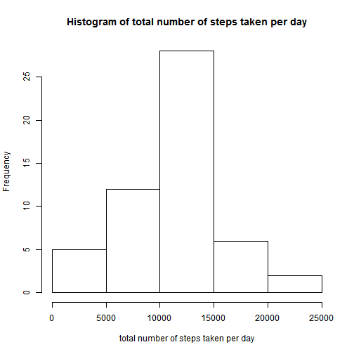

## Loading and preprocessing the data

The dataset was extracted from the activity.zip and loaded into R using read.csv().  
The "date" strings are parsed using ymd().


```r
library(utils)
library(lubridate)

# unzip dataset
zipFile <- "activity.zip"
csvFile <- unzip(zipFile, list=TRUE)$Name
unzip(zipFile)

# load dataset
data <- read.csv(csvFile, 
                 stringsAsFactors=FALSE)

# parse date string
data <- transform(data, 
                  date=ymd(date))

summary(data)
```

```
##      steps             date               interval     
##  Min.   :  0.00   Min.   :2012-10-01   Min.   :   0.0  
##  1st Qu.:  0.00   1st Qu.:2012-10-16   1st Qu.: 588.8  
##  Median :  0.00   Median :2012-10-31   Median :1177.5  
##  Mean   : 37.38   Mean   :2012-10-31   Mean   :1177.5  
##  3rd Qu.: 12.00   3rd Qu.:2012-11-15   3rd Qu.:1766.2  
##  Max.   :806.00   Max.   :2012-11-30   Max.   :2355.0  
##  NA's   :2304
```

## What is mean total number of steps taken per day?
For this part of the assignment, the missing values in the dataset were ignored.

### Make a histogram of the total number of steps taken each day.


```r
library(dplyr)

# prepare to collapse the rows by "date"
data_byDate <- group_by(data, 
                        date)

# compute the sum of steps in each day's 5-min intervals
totalSteps <- summarize(data_byDate, 
                        count=n(), 
                        count.na=sum(is.na(steps)), 
                        sum_steps=sum(steps))

summary(totalSteps)
```

```
##       date                count        count.na        sum_steps    
##  Min.   :2012-10-01   Min.   :288   Min.   :  0.00   Min.   :   41  
##  1st Qu.:2012-10-16   1st Qu.:288   1st Qu.:  0.00   1st Qu.: 8841  
##  Median :2012-10-31   Median :288   Median :  0.00   Median :10765  
##  Mean   :2012-10-31   Mean   :288   Mean   : 37.77   Mean   :10766  
##  3rd Qu.:2012-11-15   3rd Qu.:288   3rd Qu.:  0.00   3rd Qu.:13294  
##  Max.   :2012-11-30   Max.   :288   Max.   :288.00   Max.   :21194  
##                                                      NA's   :8
```

```r
# plot the histogram
with(totalSteps, {
    xname="total number of steps taken per day"
    
    hist(sum_steps, 
         xlab=xname, 
         main = paste("Histogram of", xname))
})
```

 

### Calculate and report the mean and median total number of steps taken per day


```r
# remove NAs when computing mean and median
meanTotalStepsPerDay <- mean(totalSteps$sum_steps, na.rm=TRUE)
medianTotalStepsPerDay <- median(totalSteps$sum_steps, na.rm=TRUE)

print(meanTotalStepsPerDay)
```

```
## [1] 10766.19
```

```r
print(medianTotalStepsPerDay)
```

```
## [1] 10765
```
The mean total number of steps taken per day = 1.0766189 &times; 10<sup>4</sup>.

The median total number of steps taken per day = 10765.

## What is the average daily activity pattern?

### Make a time series plot (i.e. type = "l") of the 5-minute interval (x-axis) and the average number of steps taken, averaged across all days (y-axis)


```r
# prepare to collapse the rows by "interval"
data_byInterval <- group_by(data, 
                            interval)

# calculate the mean steps in each interval, removing the NAs
averageSteps <- summarize(data_byInterval, 
                          count=n(), 
                          count.na=sum(is.na(steps)), 
                          mean_steps.na.rm=mean(steps, na.rm=TRUE))

summary(averageSteps)
```

```
##     interval          count       count.na mean_steps.na.rm 
##  Min.   :   0.0   Min.   :61   Min.   :8   Min.   :  0.000  
##  1st Qu.: 588.8   1st Qu.:61   1st Qu.:8   1st Qu.:  2.486  
##  Median :1177.5   Median :61   Median :8   Median : 34.113  
##  Mean   :1177.5   Mean   :61   Mean   :8   Mean   : 37.383  
##  3rd Qu.:1766.2   3rd Qu.:61   3rd Qu.:8   3rd Qu.: 52.835  
##  Max.   :2355.0   Max.   :61   Max.   :8   Max.   :206.170
```

```r
# Time series plot of the 5-minute interval (x-axis) and 
# the average number of steps taken, averaged across all days (y-axis)
with(averageSteps, {
    yname <- "average number of steps taken, averaged across all days"
    
    plot(interval, 
         mean_steps.na.rm, 
         type="l", 
         ylab=yname, 
         main="Time series plot")
})
```

 

### Which 5-minute interval, on average across all the days in the dataset, contains the maximum number of steps?


```r
# which row has the highest mean steps
row <- which(averageSteps$mean_steps.na.rm == max(averageSteps$mean_steps.na.rm))

# what is the 5-minute interval value of this row
intervalWithMaxMeanSteps <- averageSteps[row,]$interval

print(intervalWithMaxMeanSteps)
```

```
## [1] 835
```

The 5-minute interval with the maximum number of steps, averaged across all days = 835.

## Imputing missing values

### Calculate and report the total number of missing values in the dataset


```r
## find out whether there are NAs in each of the 3 columns
count.na <- lapply(data, 
                   function(column) sum(is.na(column)))

print(count.na)
```

```
## $steps
## [1] 2304
## 
## $date
## [1] 0
## 
## $interval
## [1] 0
```

The number of rows with NA in column "steps" is 2304.
The number of rows with NA in column "date" is 0.
The number of rows with NA in column "interval" is 0.

Therefore, the total number of missing values in the dataset = 2304.

### Devise a strategy for filling in all of the missing values in the dataset.

The chosen strategy is:
*For each NA in "steps", replace it with the "mean steps" for that 5-minute interval, averaged across all days.*

### Create a new dataset that is equal to the original dataset but with the missing data filled in.


```r
# make a copy of the original data
dataNew <- data

totalIntervalsPerDay <- nrow(averageSteps)

# var i is the row index to a 5-min interval in the original dataset
for (i in seq_along(dataNew$interval))
{
    # var j is the row index to the matching 5-min interval in averageSteps
    j <- i %% totalIntervalsPerDay
    if (j == 0) j = totalIntervalsPerDay
    
    # if row i has an NA in "steps", replace it with row j "mean_steps"
    if (is.na(dataNew[i,]$steps))
    {
        dataNew[i,]$steps <- averageSteps[j,]$mean_steps.na.rm
    }
}

summary(dataNew)
```

```
##      steps             date               interval     
##  Min.   :  0.00   Min.   :2012-10-01   Min.   :   0.0  
##  1st Qu.:  0.00   1st Qu.:2012-10-16   1st Qu.: 588.8  
##  Median :  0.00   Median :2012-10-31   Median :1177.5  
##  Mean   : 37.38   Mean   :2012-10-31   Mean   :1177.5  
##  3rd Qu.: 27.00   3rd Qu.:2012-11-15   3rd Qu.:1766.2  
##  Max.   :806.00   Max.   :2012-11-30   Max.   :2355.0
```

### Make a histogram of the total number of steps taken each day. 


```r
# prepare to collapse the rows by "date"
dataNew_byDate <- group_by(dataNew, 
                           date)

totalStepsNew <- summarize(dataNew_byDate, 
                           count=n(), 
                           count.na=sum(is.na(steps)), 
                           sum_steps=sum(steps))

summary(totalStepsNew)
```

```
##       date                count        count.na   sum_steps    
##  Min.   :2012-10-01   Min.   :288   Min.   :0   Min.   :   41  
##  1st Qu.:2012-10-16   1st Qu.:288   1st Qu.:0   1st Qu.: 9819  
##  Median :2012-10-31   Median :288   Median :0   Median :10766  
##  Mean   :2012-10-31   Mean   :288   Mean   :0   Mean   :10766  
##  3rd Qu.:2012-11-15   3rd Qu.:288   3rd Qu.:0   3rd Qu.:12811  
##  Max.   :2012-11-30   Max.   :288   Max.   :0   Max.   :21194
```

```r
# plot the histogram
with(totalStepsNew, {
    xname="total number of steps taken per day"
    
    hist(sum_steps, 
         xlab=xname, 
         main = paste("Histogram of", xname, "using new DataSet"))
})
```

 

### Calculate and report the mean and median total number of steps taken per day.


```r
# compute mean and median
meanTotalStepsPerDayNew <- mean(totalStepsNew$sum_steps)
medianTotalStepsPerDayNew <- median(totalStepsNew$sum_steps)

print(meanTotalStepsPerDayNew)
```

```
## [1] 10766.19
```

```r
print(medianTotalStepsPerDayNew)
```

```
## [1] 10766.19
```

With the new DataSet:

The mean total number of steps taken per day = 1.0766189 &times; 10<sup>4</sup>.

The median total number of steps taken per day = 1.0766189 &times; 10<sup>4</sup>.

### Do these values differ from the estimates from the first part of the assignment? What is the impact of imputing missing data on the estimates of the total daily number of steps?

With the new DataSet, the mean is unchanged but median has changed.
The impact of imputing missing data using mean value was to introdue more samples in the middle cluster, which in this case, changed median to become the mean value.

## Are there differences in activity patterns between weekdays and weekends?
For this part, the new DataSet with filled-in missing values was used.

### Create a new factor variable in the dataset with two levels - "weekday" and "weekend" indicating whether a given date is a weekday or weekend day.


```r
# function that examines each date in "dates" to see if it is a weekday
# or weekend (Sat/Sun).  It returns a character vector of the same length
# as "dates"
wday.type <- function(dates) {
    # character vector of N empty strings where N = num of elem in dates
    v <- character(length(dates))   
    
    for (i in seq_along(dates))
    {
        tempday = wday(dates[i])
    
        # saturday = 1, sunday = 7
        if ((tempday == 1) || (tempday == 7))
        {
            v[i] <- "weekend"
        }
        else
        {
            v[i] <- "weekday"
        }
    }
    v
}

# add a new factor variable "day.type" which indicates whether the date is
# a weekday or weekend (Sat/Sun)
dataNew <- transform(dataNew, 
                     day.type = wday.type(date))

summary(dataNew)
```

```
##      steps             date               interval         day.type    
##  Min.   :  0.00   Min.   :2012-10-01   Min.   :   0.0   weekday:12960  
##  1st Qu.:  0.00   1st Qu.:2012-10-16   1st Qu.: 588.8   weekend: 4608  
##  Median :  0.00   Median :2012-10-31   Median :1177.5                  
##  Mean   : 37.38   Mean   :2012-10-31   Mean   :1177.5                  
##  3rd Qu.: 27.00   3rd Qu.:2012-11-15   3rd Qu.:1766.2                  
##  Max.   :806.00   Max.   :2012-11-30   Max.   :2355.0
```

### Make a panel plot containing a time series plot (i.e. type = "l") of the 5-minute interval (x-axis) and the average number of steps taken, averaged across all weekday days or weekend days (y-axis).


```r
library(lattice)

# prepare to collapse the rows by "interval" and "day.type"
dataNew_byIntervalDayType <- group_by(dataNew, 
                                      interval, 
                                      day.type)
    
# calculate the mean steps in each interval
averageStepsNew <- summarize(dataNew_byIntervalDayType, 
                             count=n(), 
                             count.na = sum(is.na(steps)), 
                             mean_steps=mean(steps))

summary(averageStepsNew)
```

```
##     interval         day.type       count         count.na
##  Min.   :   0.0   weekday:288   Min.   :16.0   Min.   :0  
##  1st Qu.: 588.8   weekend:288   1st Qu.:16.0   1st Qu.:0  
##  Median :1177.5                 Median :30.5   Median :0  
##  Mean   :1177.5                 Mean   :30.5   Mean   :0  
##  3rd Qu.:1766.2                 3rd Qu.:45.0   3rd Qu.:0  
##  Max.   :2355.0                 Max.   :45.0   Max.   :0  
##    mean_steps     
##  Min.   :  0.000  
##  1st Qu.:  2.047  
##  Median : 28.133  
##  Mean   : 38.988  
##  3rd Qu.: 61.263  
##  Max.   :230.378
```

```r
# Panel plot of "mean_steps" vs "interval" conditioned by "data.type",
# using top/bottom panels
with(averageStepsNew, {
    xyplot(mean_steps ~ interval | day.type, 
           layout = c(1, 2), type="l", 
           ylab="Number of steps", 
           xlab="Interval")
})
```

 
